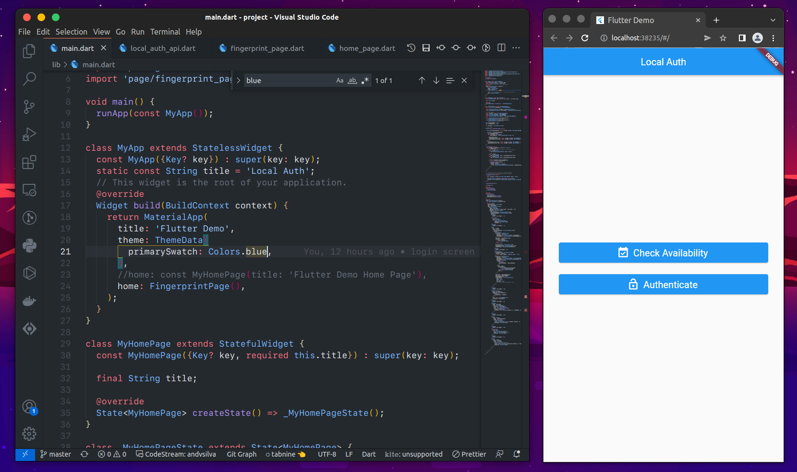
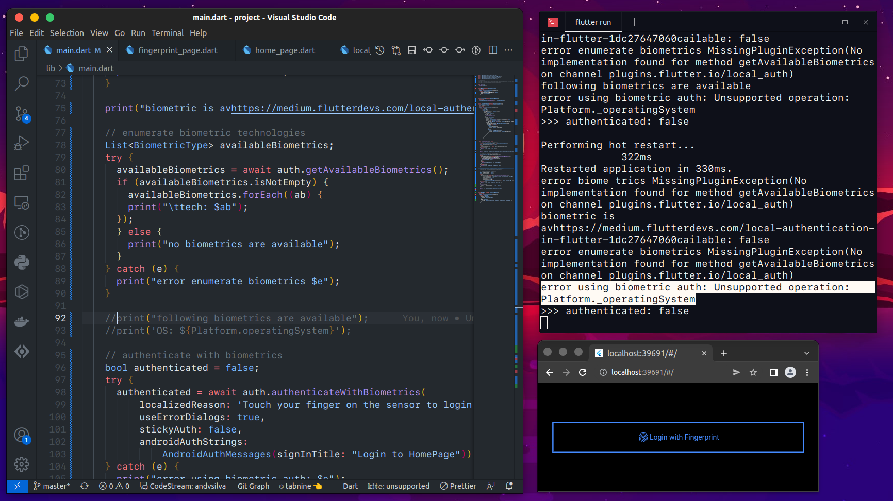

# project - Biometric - Auth

A Flutter project - Authentication using the biometric.

## Getting Started



```bash
@ andvsilva 2022-05-15 - Work in Progress - Authentication by Biometric.

Error: Unsupported operation - Web app
```


```bash
# requirements for this project.
# requirements.txt
pip3 freeze > requirements.txt

# Install pre requirements, make the command below:
$ pip install -r requirements.txt
```
